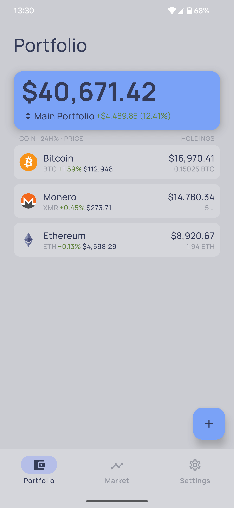
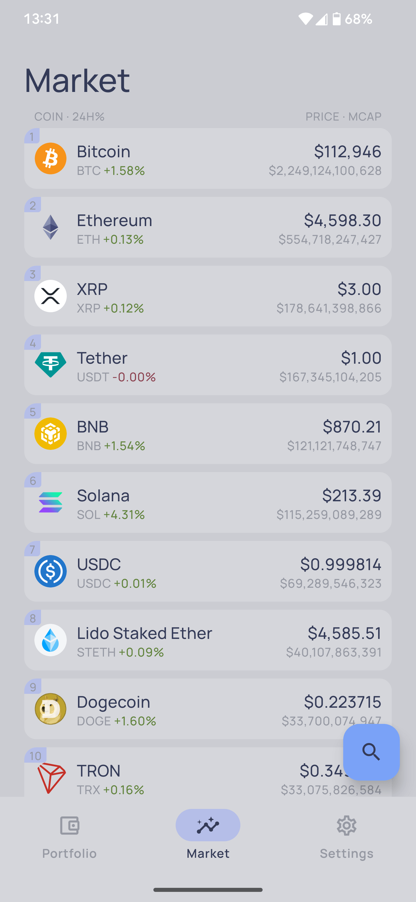
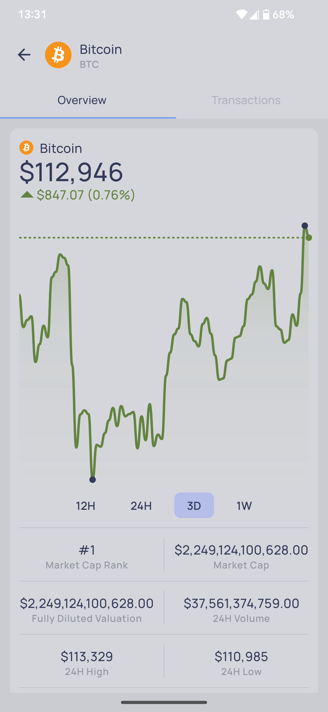
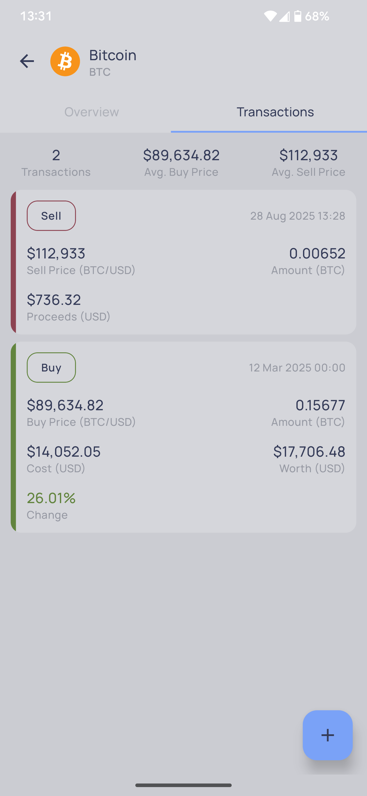
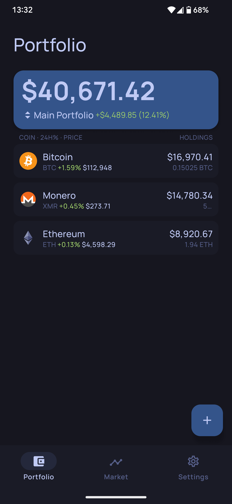
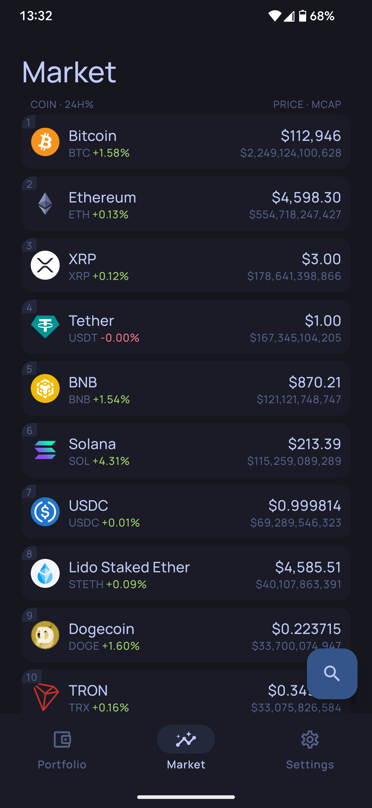
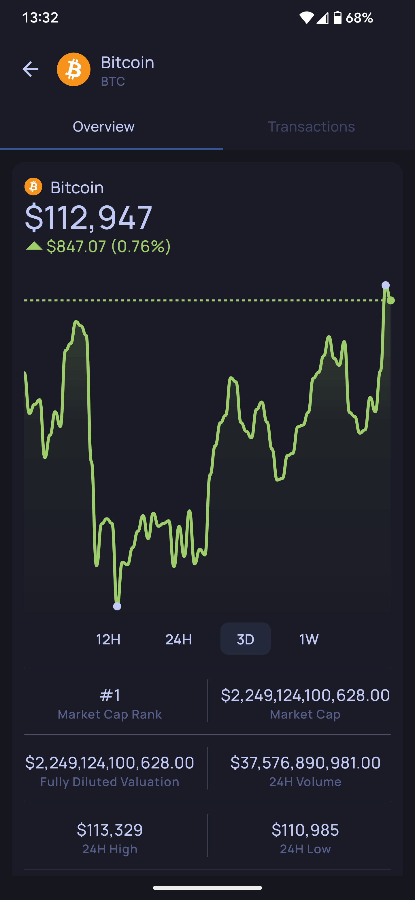
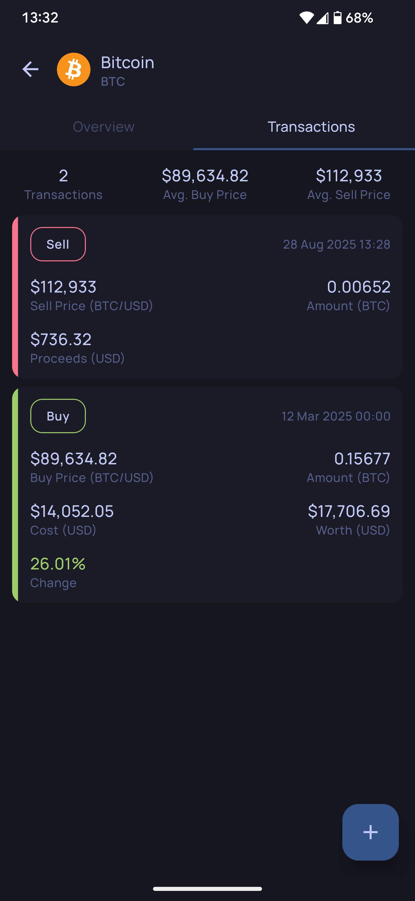

# BlockBalance
Crypto Portfolio and Market App

---

## About

Track and manage your crypto assets with **BlockBalance**.

- 📊 Monitor live crypto market rankings and price stats
- 💹 Watch detailed coin performance and infos
- 🧾 Add transactions to track your investments
- 📈 Get a clear overview of your portfolio value and distribution
- 📂 Manage multiple portfolios in one place

---

## Screenshots

	
	
	
	
	
	
	
	

